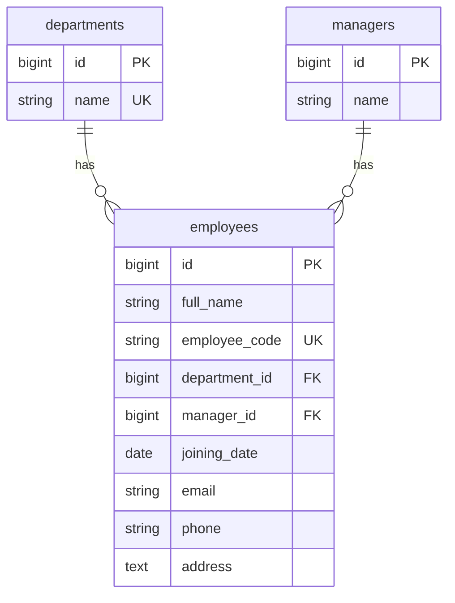
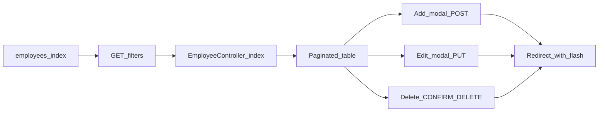

# Employee List CRUD (Laravel 10)

## Context

- Fresh Laravel **10.50.2** at [`c:\Divya\Divya Interview\E2logy_laravel`](c:\Divya\Divya Interview\E2logy_laravel)
- DB: **MySQL** ([`.env`](c:\Divya\Divya Interview\E2logy_laravel\.env)) — database `e2logy_laravel` on XAMPP (root, no password)
- UI: **Blade + Bootstrap 5** (CDN) to match the mockup (blue primary buttons, table, modal panel, pagination)
- No existing employee/department code — greenfield feature

## Database design



### Migrations (run in this order)

| # | File | Table | Key columns |
|---|------|-------|-------------|
| 1 | `create_departments_table` | `departments` | `name` (unique) |
| 2 | `create_managers_table` | `managers` | `name` |
| 3 | `create_employees_table` | `employees` | `full_name`, `employee_code` (unique), `department_id`, `manager_id`, `joining_date`, `email`, `phone`, `address` |

**FK rules:** `department_id` and `manager_id` use `foreignId()->constrained()->cascadeOnUpdate()->restrictOnDelete()` so departments/managers with employees cannot be deleted accidentally.

**Field note (mockup):** Form shows "Phone Number" label with an "Address" textarea — store both as separate columns (`phone`, `address`) for clarity.

## Backend structure

### Models ([`app/Models/`](c:\Divya\Divya Interview\E2logy_laravel\app\Models))

- `Department` — `hasMany(Employee::class)`
- `Manager` — `hasMany(Employee::class)`
- `Employee` — `belongsTo` both; `$fillable` for all employee fields; cast `joining_date` to `date`

### Controller

[`app/Http/Controllers/EmployeeController.php`](c:\Divya\Divya Interview\E2logy_laravel\app\Http\Controllers\EmployeeController.php) — resource-style methods:

| Method | Route | Behavior |
|--------|-------|----------|
| `index` | `GET /employees` | Paginated list + filters + dropdown data |
| `store` | `POST /employees` | Create, redirect with flash |
| `update` | `PUT /employees/{employee}` | Update, redirect with flash |
| `destroy` | `DELETE /employees/{employee}` | Delete with confirm, redirect |

**Filter logic in `index`** (query string, preserved via `withQueryString()`):

- `search` — `where('full_name', 'like', "%{$search}%")`
- `department_id` — exact match when not empty
- `manager_id` — exact match when not empty
- `joining_from` / `joining_to` — `whereDate('joining_date', '>=', ...)` / `<=`

Eager-load `department` and `manager` to avoid N+1. Paginate **10** per page (matches "1 of 5" style in mockup).

### Validation

[`app/Http/Requests/StoreEmployeeRequest.php`](c:\Divya\Divya Interview\E2logy_laravel\app\Http\Requests\StoreEmployeeRequest.php) and `UpdateEmployeeRequest.php`:

- `full_name` — required, max 255
- `employee_code` — required, max 50, unique (ignore current on update)
- `department_id` — required, exists in `departments`
- `manager_id` — required, exists in `managers`
- `joining_date` — required, date
- `email` — nullable, email
- `phone` — nullable, max 30
- `address` — nullable

### Routes ([`routes/web.php`](c:\Divya\Divya Interview\E2logy_laravel\routes\web.php))

```php
Route::redirect('/', '/employees');
Route::resource('employees', EmployeeController::class)->only(['index', 'store', 'update', 'destroy']);
```

## Seeders

| Seeder | Data (from mockup) |
|--------|-------------------|
| [`DepartmentSeeder`](c:\Divya\Divya Interview\E2logy_laravel\database\seeders\DepartmentSeeder.php) | Sales, HR, IT, Marketing, Finance, Operations |
| [`ManagerSeeder`](c:\Divya\Divya Interview\E2logy_laravel\database\seeders\ManagerSeeder.php) | Michael Lee, Sarah Miller (+ 2–3 extra for variety) |
| [`EmployeeSeeder`](c:\Divya\Divya Interview\E2logy_laravel\database\seeders\EmployeeSeeder.php) | 10 sample rows (E001–E010, names/departments/managers/dates from image) |

[`DatabaseSeeder`](c:\Divya\Divya Interview\E2logy_laravel\database\seeders\DatabaseSeeder.php) calls them in order: Department → Manager → Employee.

**Post-setup command:**

```powershell
php artisan migrate:fresh --seed
```

## Frontend (Blade)

### Layout

[`resources/views/layouts/app.blade.php`](c:\Divya\Divya Interview\E2logy_laravel\resources\views\layouts\app.blade.php) — Bootstrap 5 CSS/JS, Bootstrap Icons, flash alerts, `@yield('content')`.

### Main page

[`resources/views/employees/index.blade.php`](c:\Divya\Divya Interview\E2logy_laravel\resources\views\employees\index.blade.php):

**Header:** "Employees List" + blue "+ Add Employee" button (opens modal).

**Filter row** (GET form to `/employees`, preserves values):

- Text: "Search by Name"
- Select: "All Departments" + options from `$departments`
- Select: "All Managers" + options from `$managers`
- Date: Joining From / Joining To (two `type="date"` inputs)
- Submit via auto-filter on change or small "Apply" button

**Table columns:** Employee Name (link opens edit modal), Employee Code, Department, Manager, Joined Date (`m/d/Y`), Actions (Edit / Delete).

**Pagination:** Laravel `{{ $employees->links() }}` styled as Previous | Page X of Y | Next.

**Delete:** Bootstrap confirm modal before `DELETE` form.

### Add/Edit modal

[`resources/views/employees/partials/form-modal.blade.php`](c:\Divya\Divya Interview\E2logy_laravel\resources\views\employees\partials\form-modal.blade.php):

- Single modal reused for Add and Edit
- Fields: Full Name, Employee Code, Department dropdown, Manager dropdown, Joining Date, Email, Phone, Address (textarea)
- Footer: Cancel (gray), Save Employee (blue)
- Small JS snippet: Edit button sets form `action`, `_method`, and field values from `data-*` attributes on the row

No separate create/edit pages — matches the side-panel mockup.

## UI flow



## Files to create (summary)

**Migrations:** 3 files in [`database/migrations/`](c:\Divya\Divya Interview\E2logy_laravel\database\migrations)

**Models:** `Department.php`, `Manager.php`, `Employee.php`

**Controllers/Requests:** `EmployeeController.php`, `StoreEmployeeRequest.php`, `UpdateEmployeeRequest.php`

**Seeders:** `DepartmentSeeder.php`, `ManagerSeeder.php`, `EmployeeSeeder.php` + update `DatabaseSeeder.php`

**Views:** `layouts/app.blade.php`, `employees/index.blade.php`, `employees/partials/form-modal.blade.php`

**Routes:** update [`routes/web.php`](c:\Divya\Divya Interview\E2logy_laravel\routes\web.php)

## Verification checklist

1. `php artisan migrate:fresh --seed` — 6 departments, managers, 10+ employees
2. Open `http://127.0.0.1:8000/employees` — table matches mockup structure
3. Filters: name search, department/manager dropdowns, date range all narrow results
4. Add Employee modal — saves with validation errors shown inline
5. Edit — pre-fills modal; unique employee code enforced on update
6. Delete — removes row after confirmation
7. Pagination keeps filter query string when changing pages

## Out of scope (unless you ask later)

- User authentication / roles
- API-only (JSON) endpoints
- Soft deletes on employees
- Manager–department relationship (managers are independent lookup table per your request)
